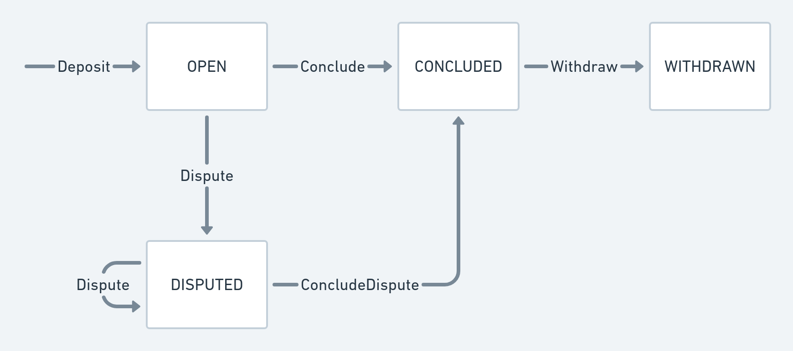

<h1 align="center"><br>
    <a href="https://perun.network/"></a>
<br></h1>

<h4 align="center">Perun CosmWASM Contracts</h4>

<p align="center">
  <a href="https://www.apache.org/licenses/LICENSE-2.0.txt"></a>
  </a>
  <a href="https://github.com/perun-network/perun-cosmwasm/actions/workflows/rust.yml"></a>
  </a>
</p>

*Perun CosmWASM Contracts* provides [go-perun] state channels for all *Cosmos* compatible blockchains.  

## Repo structure
* `src/`
  * `contract.rs`, `msg.rs`, `storage.rs` core logic
  * `types.rs` custom types
  * `errors.rs` custom errors
  * `crypto.rs` signature helpers
* `tests/`
  * `common/` helpers
  * `crypto.rs` signature tests
  * `deposit.rs`, `conclude.rs`, `dispute.rs`, `withdraw.rs` core logic tests
  * `types.rs` custom type tests
* `examples/`
  * `schema.rs` schema exporter
  * `serde.rs` helper for *go-perun* connector testing
* `schema/` CosmWASM schemata
* `Cargo.toml` rust project configuration
* `Makefile.toml` convenience aliases for *cargo*

## Development Workflow
This project uses a `cargo-make` which wraps `cargo` to run dev related tasks. Install it with:  
```sh
cargo install cargo-make
```
You can then use the following command to run all CI checks:
```sh
cargo make ci
```
`.rust-hooks.toml` defines this task as *pre-push* hook to avoid CI failures.  
The first invocation will take longer since it installs additional dependencies.

## Protocol

A state channel is opened by depositing funds for it into the contract by calling *Deposit*.  
The participants of the channel can then do as many off-chain channel updates as they want.  
When all participants come to the conclusion that the channel should be closed, they set the final flag on the channel state, and call *Conclude*.  
All of them can then withdraw the outcome with *Withdraw*, which closes the channel.  

*Dispute* and *ConcludeDispute* are only needed for the dispute case.  
They allow every participant to enforce the last valid state, i.e., the mutually-signed state with the highest version number.  
A dispute is initiated by calling dispute with the latest available state. A registered state can be refuted by calling dispute with a newer state.
All participants can then withdrawn their funds after the dispute was resolved.

### Channel state diagram



### Functions, Queries and Types

Functions
- **Deposit(funding_id, amount)** allows a participant to transfer funds into a channel. It is called by each channel participant in order to open the channel.
- **Conclude(params, state, sigs)** collaboratively closes a channel in one step. Only works if all participants signed the state.
- **Dispute(params, state, sigs)** opens a dispute with the passed *state*. Only works if all participants signed the state.
- **ConcludeDispute(params, channel_id)** concludes a dispute after its timeout ran out.
- **Withdraw(withdrawal, sig)** withdraws the outcome of a channel of a single participants. All participants can call this function after the channel is concluded.

Queries
- **Deposit(funding_id)** returns the deposit that is held in the funding id.
- **Dispute(channel_id)** returns a channels dispute or an error if none is found.

Types
- **Params** defines the constant configuration of a channel.
- **State** represents an off-chain state of a channel.
- **Dispute** stores a dispute.
- **Withdrawal** authorizes an on-chain funds withdrawal.
- **ChannelID** (aka *channel_id*) uniquely identifies a channel. Calculated as `Hash(params)`.
- **FundingID** (aka *funding_id*) uniquely identifies a participant in a channel. Calculated as `Hash(channel_id|participant)`.

## Schema generation
All `json` schema files can be found in the `schema` directory.  
You can generate them with:  
```sh
cargo make schema
```

## Release build
A reproducible and optimized production build can be created with:
```sh
cargo make optimize
```
This will create a `artefacts/perun_cosmwasm.wasm` binary with checksum file which can be deployed to a *Cosmos* chain.

## TODO (remove before submission)
- Search for TODOs in the code
- What happens when a function panics? *CosmWASM* specifically advertises that overflows panic, which makes it sound like a good thing.
- Unfunded channels can be disputed.
- Add sensible constants for maximum values. Eg: `MAX_NUM_PARTS` and update the tests
- Release builds in Release CIs
- Input validation?
- See if the typedef approach for `ExecuteMsg`s work out or if it have to be transformed back into structs.

## Funding

This project is developed for the Robert Bosch GmbH, Germany.  

## Security Disclaimer

This software is still under development.
The authors take no responsibility for any loss of digital assets or other damage caused by the use of it.

## Copyright

Copyright 2021 PolyCrypt GmbH.  
Use of the source code is governed by the Apache 2.0 license that can be found in the [LICENSE file](LICENSE).

<!--- Links -->

[go-perun]: https://github.com/hyperledger-labs/go-perun
