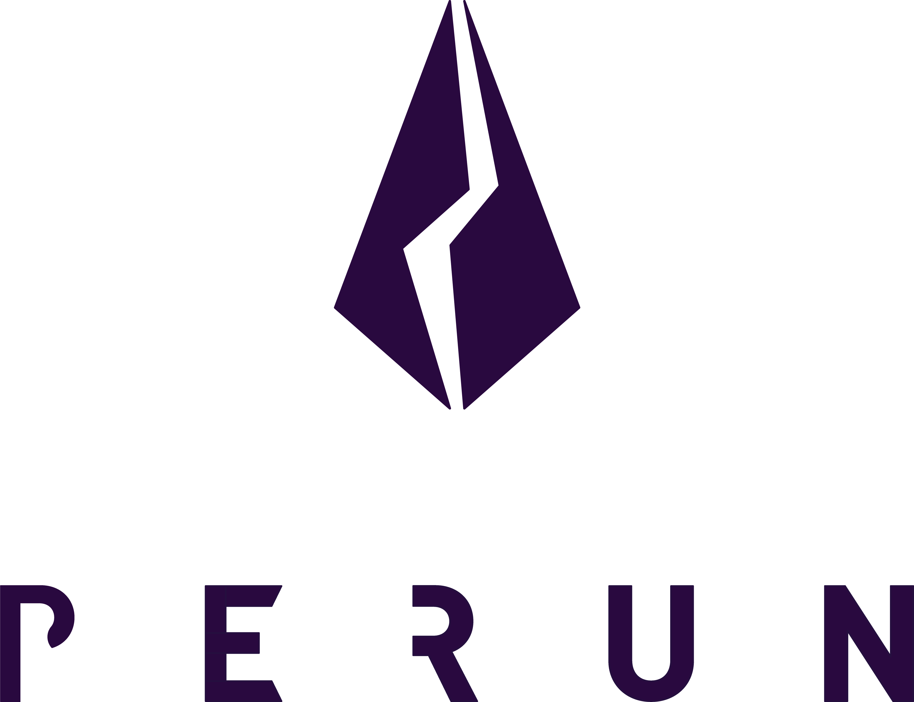

<h1 align="center"><br>
    <a href="https://perun.network/"></a>
<br></h1>

<h2 align="center">Perun CosmWasm: Contract</h2>

<p align="center">
  <a href="https://www.apache.org/licenses/LICENSE-2.0.txt"></a>
  </a>
  <a href="https://github.com/perun-network/perun-cosmwasm-contract/actions/workflows/rust.yml"></a>
  </a>
</p>

This repository contains an implementation of the [Perun](https://perun.network/) smart contract for [CosmWasm](https://www.cosmwasm.com).

## Repo structure
* `src/`
  * `contract.rs`, `msg.rs`, `storage.rs` core logic
  * `types.rs` custom types
  * `errors.rs` custom errors
  * `crypto.rs` signature helpers
  * `tests/` tests
* `examples/`
  * `schema.rs` schema generation
* `schema/` generated JSON schemata
* `Cargo.toml` rust project configuration
* `Makefile.toml` build commands


## Development Workflow
Ensure [rustup](https://rustup.rs/) is installed with target `wasm32-unknown-unknown` and `cargo` is available.
Consult the [CosmWasm documentation](https://docs.cosmwasm.com/docs/0.16/getting-started/installation) for guidance.

This project uses [`cargo-make`](https://github.com/sagiegurari/cargo-make) to run dev related tasks. Install it with:  
```sh
cargo install cargo-make
```
You can then use the following command to run all CI checks:
```sh
cargo make ci
```

## Protocol

A channel is opened by depositing funds for it into the contract by calling *Deposit*.
The participants of the channel can then do as many off-chain channel updates as they want.
When all participants come to the conclusion that the channel should be closed, they set the final flag on the channel state, and call *Conclude*.
All of them can then withdraw the outcome by calling *Withdraw*. 

*Dispute* and *ConcludeDispute* are only needed if the particpants do not arrive at a final channel state off-chain.
They allow any participant to enforce the last valid state, i.e., the mutually-signed state with the highest version number.
A dispute is initiated by calling *Dispute* with the latest available state.
A registered state can be refuted within a specified challenge period by calling *Dispute* with a newer state.
After the challenge period, the dispute can be concluded by calling *ConcludeDispute* and the funds can be withdrawn.

### State diagram

```pre
           ┌────────┐                 ┌─────────────┐            ┌─────────────┐
  Deposit  │        │    Conclude     │             │  Withdraw  │             │
──────────►│  OPEN  ├────────────────►│  CONCLUDED  ├───────────►│  WITHDRAWN  │
           │        │                 │             │            │             │
           └───┬────┘                 └─────────────┘            └─────────────┘
               │                             ▲
               │                             │
            Dispute                          │
               │                             │
               │                             │
               ▼                             │
           ┌────────┐                        │
     ┌─────┤        │     Conclude           │
  Dis│pute │DISPUTED├────────────────────────┘
     └────►│        │
           └────────┘
```

## Schema generation
All `json` schema files can be found in directory `schema/`.
You can generate them with:  
```sh
cargo make schema
```

## Release build
A reproducible and optimized production build can be created with:
```sh
cargo make optimize
```
This command requires [Docker](https://www.docker.com).
The compiled contract will be placed in `artifacts/`.

## Security Disclaimer

This software is still under development.
The authors take no responsibility for any loss of digital assets or other damage caused by the use of it.

## Copyright

Copyright 2021 PolyCrypt GmbH.

Use of the source code is governed by the Apache 2.0 license that can be found in the [LICENSE file](LICENSE).
